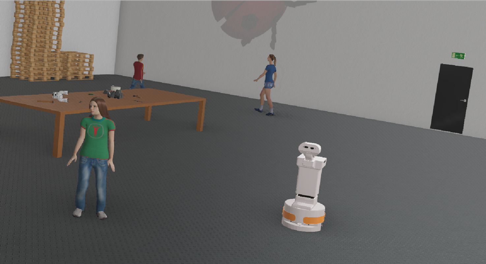

# hunav_webots_wrapper

**This version is still WIP**

This is a **ROS2 wrapper** to use [**HuNavSim**](https://github.com/robotics-upo/hunav_sim) with the **Webots** simulator (tested with ROS2 Humble and Webots R2025a). We provide three different simulation scenes (an office, a factory, and a hall) with different agent configurations.



## Main components

This wrapper contains two ROS2 nodes:

* The *hunav_webots_world_generator* node reads configuration parameters from HuNavSim (*hunav_loader* module) and populates a base world (.wbt file) with the agents in the desired configuration. Three different agent configurations files (.yaml) are provided in the config folder.
* The *HuNavPlugin* node is the Webots plugin implementation that interacts with HuNavSim to read and control the movement of the human agents.


## Dependencies

* The HuNavSim: https://github.com/robotics-upo/hunav_sim
* The Webots simulator together with the ROS2 package *webots_ros2*: please follow the instructions [here](https://github.com/cyberbotics/webots_ros2/wiki/Getting-Started) to install them.
* The Navigation 2 package, which is used to control the robot. You can install it with this command:
 ```sh 
    sudo apt install ros-$(ROS_DISTRO)-nav2-bringup
  ```

This package incorporates the [TIAGo](https://github.com/cyberbotics/webots_ros2/wiki/Example-TIAGo) robot by PAL Robotics in the simulation, which is included as part of the *webots_ros2* package.

To use the package, clone it to you ROS2 workspace and compile it with the standard colcon tool:

 ```sh     
    colcon build --packages-select hunav_webots_wrapper
  ```

## Usage example

This package provides three different scenarios already set up with three different pre-configurations of human agents: 
`office`, `factory` and `hall`. You can find their respective configuration files in the <em>config</em> folder. Feel free to modify them to simulate different behaviors, number of agents, etc. For example, to launch the `factory` scenario, you can run in your terminal:

 ```sh 
    ros2 launch hunav_webots_wrapper hunavsim_launch_factory.py
  ```

This will cause Webots to launch the simulated environment with the specified agents. An rviz window will pop up too. You can send goals to the robot using the standard Nav2 Goal tool. 

## Troubleshooting

The simulator may take a while to load after a clean build, which can result in HuNavSim not properly loading the agents. If this happens, close the simulator with Ctrl+C and launch it again.
